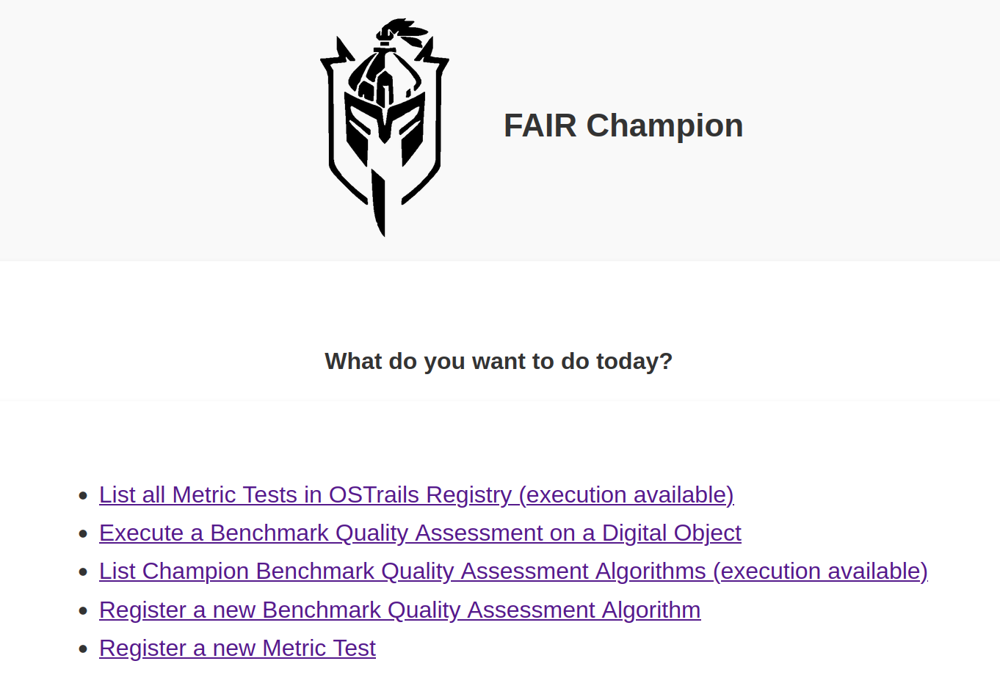
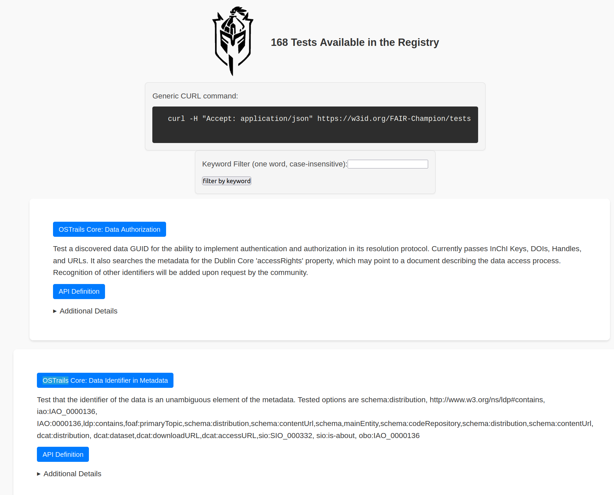
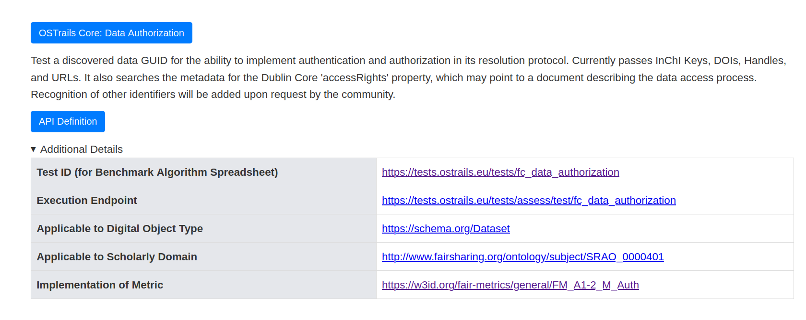
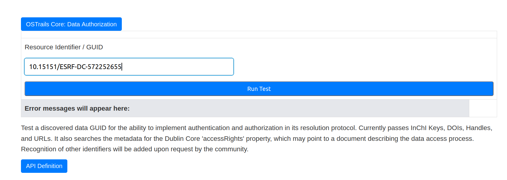
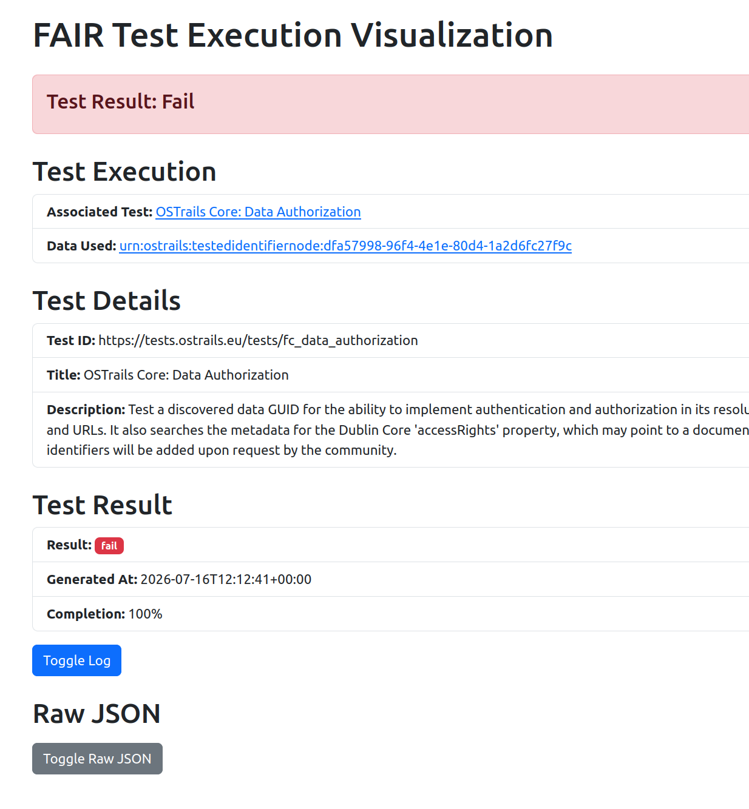
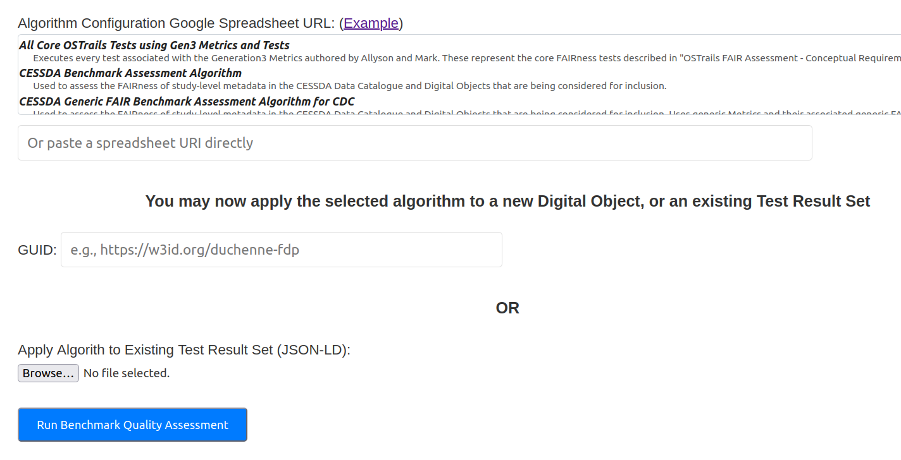
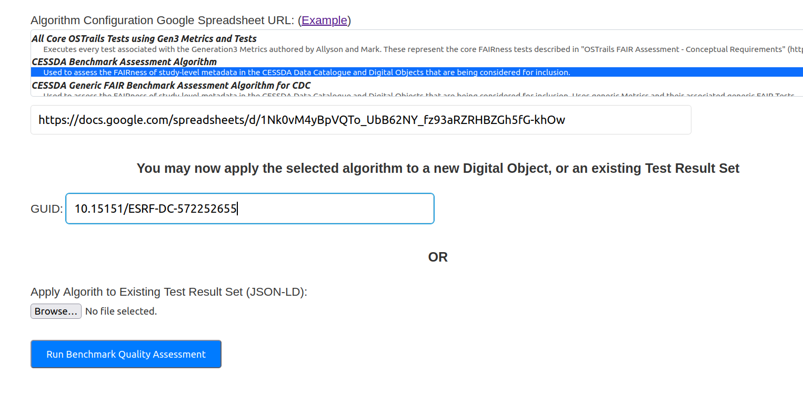
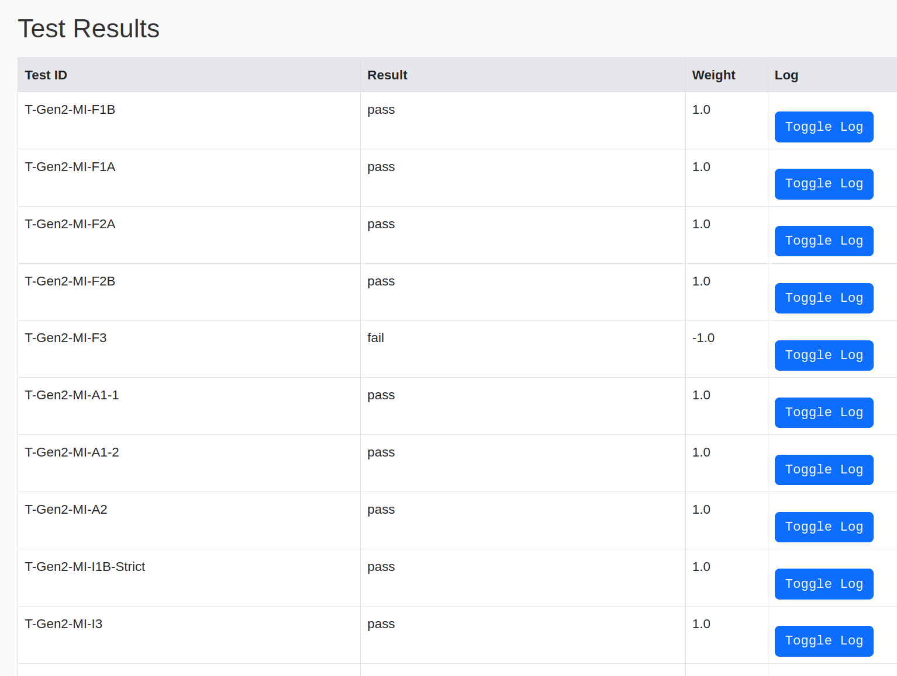
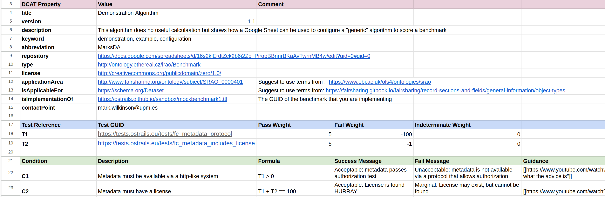

# FAIR Champion

[](https://github.com/markwilkinson/FAIR-Champion/actions/workflows/ci.yml)

An evolution of the FAIR Evaluator, designed in alignment with the [OSTrails project](https://ostrails.eu/).

FAIR Champion helps you **assess the FAIRness of digital objects** (datasets, metadata records, repositories...). It lets you:

* **Browse and execute FAIR Metric Tests** registered in the OSTrails Test Registry, against any digital object you identify by its GUID (URL, DOI, or other resolvable identifier)
* **Run Benchmark Quality Assessments** — community-defined *algorithms* that execute a suite of tests and score/interpret the results against a Benchmark
* **Register your own Metric Tests and Assessment Algorithms** so that others can discover and run them

A public instance is available at **<https://w3id.org/FAIR-Champion>** (hosted at `https://tools.ostrails.eu/champion`), so you do not need to install anything to use it.

---

## Table of Contents

1. [Key Concepts](#key-concepts)
2. [Getting Started](#getting-started)
3. [Walk-through](#walk-through)
   * [The Homepage](#the-homepage)
   * [Browsing and Executing Metric Tests](#browsing-and-executing-metric-tests)
   * [Running a Benchmark Quality Assessment](#running-a-benchmark-quality-assessment)
   * [Registering a new Assessment Algorithm](#registering-a-new-assessment-algorithm)
   * [Registering a new Metric Test](#registering-a-new-metric-test)
4. [Using the API](#using-the-api)
5. [Running your own instance](#running-your-own-instance)
6. [Configuration](#configuration)
7. [Acknowledgements](#acknowledgements)

---

## Key Concepts

| Concept | Meaning |
| --- | --- |
| **Digital Object** | The thing being assessed — identified by a GUID (e.g. a DOI, a URL to a dataset or FAIR Data Point) |
| **Metric** | A formal definition of *what* is being measured (e.g. "identifier persistence"), following the [FTR](https://w3id.org/ftr) model |
| **Metric Test** | An executable implementation of a Metric, published as a web API and registered in the OSTrails Registry |
| **Benchmark** | A community-defined set of Metrics that together represent "good practice" for that community |
| **Assessment Algorithm** | A scoring function — defined in a Google Spreadsheet — that says *which* tests to run, how to *weight* their pass/fail/indeterminate results, and how to *interpret* the total score |
| **Result Set** | The JSON-LD output of a test run or assessment; can be saved and re-scored later by other algorithms |

## Getting Started

The easiest way to use FAIR Champion is the public instance:

> **<https://w3id.org/FAIR-Champion>**

Everything described in the walk-through below can be done there with no installation. If you want to host your own instance, see [Running your own instance](#running-your-own-instance).

---

## Walk-through

### The Homepage

Open the Champion homepage. It offers five entry points:

* **List all Metric Tests in OSTrails Registry** — browse tests, and execute any of them directly from the browser
* **Execute a Benchmark Quality Assessment on a Digital Object** — run a full scoring algorithm
* **List Champion Benchmark Quality Assessment Algorithms** — browse registered algorithms (execution available)
* **Register a new Benchmark Quality Assessment Algorithm**
* **Register a new Metric Test**



### Browsing and Executing Metric Tests

Click **"List all Metric Tests in OSTrails Registry"** (or go to `/champion/tests`). Champion queries the OSTrails FDP Index and shows every registered test with its title and description.

> **Tip:** you can filter the list by keyword with `/champion/tests/?keyword=identifier` — the filter matches against test titles and descriptions.



Each test entry offers:

* **The test title** (click to expand an execution form)
* **A description** of what the test measures
* **API Definition** — a link to the test's OpenAPI specification
* **Additional Details** — an expandable panel showing the test's registry ID, its execution endpoint, the digital-object types and scholarly domains it applies to, and the Metric it implements



To **execute a test**, click its title. Champion reads the test's OpenAPI definition and builds the appropriate submission form:

* Most tests ask for a **Resource Identifier** — the GUID of the digital object you want to assess
* Some tests (e.g. RO-Crate validators) instead accept a **metadata file upload** (JSON)

Enter your GUID and click submit.  

**NOTE:  In the case of DOIs, you can either enter the DOI in its raw form (e.g. 10.15151/ESRF-DC-572252655) or as a URL (https://doi.org/10.15151/ESRF-DC-572252655).  If you enter it as a raw DOI, you will include the datacite/crossref metadata in addition to landing page metadata as part of the test.  If you enter it as a URL, you will skip datacite/crossref metadata extraction and retrieve data exclusively from the landing page.**



The result page shows the outcome of the test — **pass / fail / indeterminate** — together with the full execution log explaining *why* the test reached that conclusion, and the raw JSON-LD result available for download.



### Running a Benchmark Quality Assessment

From the homepage, click **"Execute a Benchmark Quality Assessment on a Digital Object"** (or go to `/champion/assess/algorithms/new`).

The page shows a **selection list of all registered algorithms** (title and description). Selecting one fills its spreadsheet URI into the text box — or you can paste the URI of any algorithm spreadsheet directly.



Then provide **one of**:

* **GUID** — the identifier of the digital object to assess. Champion will execute every test in the algorithm's suite (in parallel) against that object, then score the results; **or**
* **An existing Test Result Set** (JSON-LD file upload) — Champion skips test execution and applies the algorithm's scoring/interpretation directly to the uploaded results. This lets you re-score results produced earlier, or by other FTR-compliant tools (e.g. F-UJI, FOOPS).

Click **"Run Benchmark Quality Assessment"**.



The output page contains:

* **The algorithm's metadata** — what benchmark it implements, who maintains it
* **Individual test results** — each test's pass/fail/indeterminate status with its log
* **Narratives and Guidance** — the algorithm's interpretation of your score: which conditions were met, success/failure messages, and practical guidance on how to improve
* **The complete Result Set** in JSON-LD, available for download and later re-use



### Registering a new Assessment Algorithm

An algorithm is defined entirely in a **Google Spreadsheet** — no code required. Start by copying the [example spreadsheet](https://docs.google.com/spreadsheets/d/16s2klErdtZck2b6i2Zp_PjrgpBBnnrBKaAvTwrnMB4w/edit?gid=0#gid=0), which contains three blocks separated by blank rows:

1. **Metadata block** (`DCAT Property` / `Value` columns) — the title, description, version, contact point, license of your algorithm, and the Benchmark it implements (`isImplementationOf`)
2. **Tests block** — one row per Metric Test in the suite: the `Test GUID` (from the test registry — shown in each test's "Additional Details" panel), plus `Pass Weight`, `Fail Weight` and `Indeterminate Weight` used in scoring
3. **Conditions block** — scoring rules: each row has a `Formula` (arithmetic over the weighted test results), `Success Message`, `Fail Message`, and `Guidance` text that will appear in the assessment output



Make sure the spreadsheet is **publicly readable** ("Anyone with the link can view"), then go to **"Register a new Benchmark Quality Assessment Algorithm"** (`/champion/algorithms/new`), paste the spreadsheet URL, and click **Register**.


Champion extracts the metadata, registers the algorithm in the OSTrails Index (this takes a few seconds), and then shows the algorithm's display page. Your algorithm now appears in the algorithm list and in the assessment selection form, and can be executed by anyone.


### Registering a new Metric Test

If you have built your own Metric Test (a web service that follows the OSTrails test API pattern and describes itself in DCAT), you can register it from **"Register a new Metric Test"** (`/champion/tests/new`).

Provide the **URL of your test's DCAT record** — the URL must return Turtle (TTL) directly, *without* requiring content negotiation. Click **Register Test**.

Champion submits the record to the OSTrails FDP Index; once ingested, your test appears in the test list alongside all the others, ready to be executed and referenced from algorithm spreadsheets.

---

## Using the API

Everything in the walk-through can also be done programmatically. The OpenAPI specification is available at `/champion/api` (`championAPI.yaml`). All endpoints send CORS headers, so browser-based clients are welcome. Selected examples:

**List all registered tests (JSON):**

```bash
curl -H "Accept: application/json" https://tools.ostrails.eu/champion/tests/
# optional keyword filter:
curl -H "Accept: application/json" "https://tools.ostrails.eu/champion/tests/?keyword=license"
```

**Execute a single test against a digital object** (via the test-execution proxy):

```bash
curl -X POST -H "Accept: application/json" \
     -d "endpoint=https://tests.ostrails.eu/tests/assess/test/fc_metadata_persistence" \
     -d "resource_identifier=https://w3id.org/duchenne-fdp" \
     https://tools.ostrails.eu/champion/test-execution-proxy
```

**Run a Benchmark Quality Assessment** on a digital object:

```bash
curl -X POST -H "Accept: application/json" -H "Content-type: application/json" \
     -d '{"guid": "https://my.favorite.digital/object"}' \
     https://w3id.org/FAIR-Champion/assess/algorithm/d/16s2klErdtZck2b6i2Zp_PjrgpBBnnrBKaAvTwrnMB4w
```

(the algorithm ID is the `/d/...` or `/u/...` portion of its Google Sheets URL)

**Re-score an existing Result Set** (JSON-LD) with an algorithm:

```bash
curl -X POST -H "Accept: application/json" -H "Content-type: application/json" \
     -d @resultset.jsonld \
     https://w3id.org/FAIR-Champion/assess/algorithm/d/16s2klErdtZck2b6i2Zp_PjrgpBBnnrBKaAvTwrnMB4w
```

**Register a new Metric Test:**

```bash
curl -X POST -H "Content-type: application/json" \
     -d '{"test_turtle": "https://my.domain.org/path/to/test/DCAT.ttl"}' \
     https://tools.ostrails.eu/champion/tests/new
```

Responses honour the `Accept` header: `text/html` for browser use, `application/json` / `application/ld+json` for machine use (algorithm metadata is additionally available as `text/turtle`).

## Running your own instance

The service is distributed as a Docker image (`markw/fair-champion`). The simplest deployment uses the provided [docker-compose.yml](docker-compose.yml):

```bash
docker compose up -d
```

This starts Champion (published on port 8383 by default, internal port 4567) together with a `swagger-converter` companion container.

To run from source instead (Ruby ≥ 3.2):

```bash
bundle install
ruby run.rb
```

The app then serves at `http://localhost:4567/champion/`.

## Configuration

All configuration is via environment variables (a `.env` file is honoured in development); every variable has a sensible default pointing at the public OSTrails infrastructure:

| Variable | Purpose | Default |
| --- | --- | --- |
| `TEST_HOST` | Base URL of the Metric Test service | `https://tests.ostrails.eu/tests` |
| `CHAMP_HOST` / `CHAMPION_HOST` | Public base URL of this Champion instance | `https://tools.ostrails.eu/champion` |
| `FDPINDEX_SPARQL` | SPARQL endpoint of the FDP Index (test/algorithm registry) | `https://tools.ostrails.eu/repositories/fdpindex-fdp` |
| `FDPINDEXPROXY` | FDP Index ingestion proxy (used for registration) | `https://tools.ostrails.eu/fdp-index-proxy/proxy` |

## Acknowledgements

Developed in the context of the **OSTrails** project and the **FAIR Champion** initiative.

This project has received funding from the European Union’s Horizon Europe framework programme under grant agreement No. 101130187. Views and opinions expressed are however those of the author(s) only and do not necessarily reflect those of the European Union or the European Research Executive Agency. Neither the European Union nor the European Research Executive Agency can be held responsible for them.

---

**Made with ❤️ for the FAIR community**
